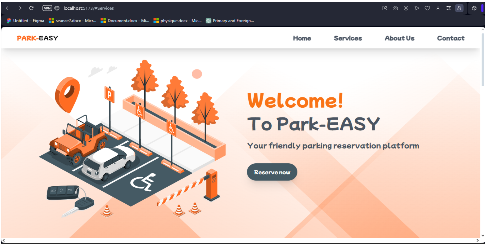

# ParkEasy: Private Parking Management System

## 🌟 Project Description

**ParkEasy** is a private parking management system designed to streamline the process of reserving parking spaces, handling user subscriptions, and providing administrative tools for efficient parking management. This database application aims to solve the challenges associated with managing parking spaces by offering a dynamic interaction between users seeking available spots, making reservations, and subscribing to long-term plans.

---

## 📂 Project Structure

The project is documented in the following chapters:
1. **Chapter 01**: Requirement Analysis 
2. **Chapter 02**: Conception of the project
3. **Chapter 03**: Development of the project
4. **Chapter 04**: General Conclusion  

---

## 📄 Project Resources
- [📘 Full Project Report (PDF)](./BDD_report.pdf)
  ###
  **Note**: The project report is too large to be rendered directly on GitHub, so please click to download it.
  
---
## 🛠️ Technologies Used

### **Back-End**
- **Programming Language**: JavaScript  
  JavaScript serves as the primary language used for both server-side and client-side development in the project.  

- **Server-Side Framework**: Node.js with Express.js  
  Node.js is a JavaScript runtime for server-side development, while Express.js provides a web application framework with essential features for building web and mobile applications.  

- **Database**: PostgreSQL  
  PostgreSQL is used for database operations, with SQL queries handling secure and efficient data storage and retrieval.  

- **HTTP Requests**: Axios  
  Axios simplifies asynchronous HTTP requests between the client and the server, providing a streamlined approach to communication.  

- **API Testing Tool**: POSTMAN  
  POSTMAN is used for building, testing, and documenting APIs, offering a user-friendly interface for testing endpoints, managing environments, and validating API responses.  


---

### **Front-End**
- **Framework**: React  
  React enables the creation of dynamic, interactive, and high-performance user interfaces, providing a smooth user experience.  

- **Styling**: Tailwind CSS  
  Tailwind CSS simplifies the styling process with utility-first CSS, allowing for rapid and responsive design implementations.  

- **Build Tool**: Vite  
  Vite offers a fast and optimized development environment with instant server startup and efficient hot module replacement (HMR).  

---

## 🚀 How to Run the Project

To run the **GL-Project** locally, follow these steps:

### **1. Clone the Repository**

First, clone the repository to your local machine:

```bash

# Clone the repository
git clone https://github.com/Chourouq/GL-Project.git
cd GL-Project
```
### **2. Set Up the Front-End**
```bash

# Navigate to the frontend directory
cd frontend

# Install the dependencies
npm install

# Start the development server
npm start
```
### **3. Set Up the Back-End**
```bash
# Navigate to the backend directory
cd ../backend

# Install the dependencies
npm install

# Start the Express.js server
npm start
```
### **4. Access the Application**

After setting up the front-end and back-end, access the application as follows:

- **Front-End**: Open your browser and navigate to [http://localhost:3000](http://localhost:3000).
- **Back-End**: To test your backend, use tools like [Postman](https://www.postman.com/) or access your endpoints directly in the browser (e.g., `http://localhost:5000`).

---

## 📞 Contact

For any inquiries or collaboration, feel free to reach out to me:

- **Email**: batiche.chourouq@gmail.com
- **LinkedIn**: [Chourouq Batiche](https://www.linkedin.com/in/chourouq-batiche-bb8a2a334/)

I look forward to hearing from you!


